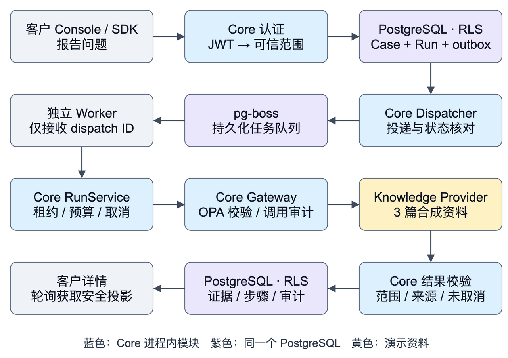

# agent18 运行机制与实现综述

> 历史记录：本文和同目录 Word 文件描述 0.2 基线。当前能力见 [0.3 运行机制与实现综述](agent18-0.3-mechanism.md)。
版本：0.2.0 · 第二轮研发交付 · 2026-09-15

本文面向产品负责人、研发和接入方，说明当前代码怎样运行、已经实现什么、如何验证，以及距离完整产品还有哪些工作。事实基线为本地工作区、数据库迁移 001 / 002 和本轮验收；架构规划中的未来能力另行标注。

## 1 当前产品能做什么

agent18 的目标是嵌入已有 SaaS，把客户问题与知识、业务数据、运行时证据和工程修复连接起来。总体方向是 Ask → Answer → Investigate → Diagnose → Resolve → Fix，按客户已有系统逐步接入。

**当前交付的是这条长链路的基础部分。** 客户可报告问题、查询自己的记录、检索演示资料、查看引用和审计，并取消或重新发起调查。执行由服务端限定的工作流完成；没有真实模型推理、动态任务规划或代码修复。

| 能力 | 0.2.0 的实际行为 |
|---|---|
| 客户支持入口 | React Console + Headless SDK；报告、列表、详情、知识检索 |
| 身份与数据隔离 | 短期 JWT；组织 / 项目 / 租户 / 用户范围；数据库 FORCE RLS |
| 持久化调查 | Case、Run、outbox 同事务；独立 Worker；重投去重与恢复 |
| 工具与证据 | OPA 默认拒绝；只开放已审核的只读知识检索；来源和输出校验 |
| 本轮新增 | 取消、有限重试、执行记录、预算限制、队列失败状态收敛 |
| 当前资料来源 | 3 篇明确标识的合成知识，返回原文及版本；未接入真实知识库 |
| 尚未提供 | 生成式回答、业务查询、日志 / Trace、RCA、Sandbox、审批与 PR |

**完成调查不代表解决故障。** 当前 completed 表示资料检索完成；Case 随后进入 needs_human，界面显示“待人工跟进”。取消也保留问题和历史，不会把问题标为已解决。

当前仍处于 M0 基础建设阶段，M0 整体尚未结项。这是可运行的本地开发版本，尚未发布远程仓库、npm 包或公共镜像。

<!-- pagebreak -->

## 2 系统由哪些部分组成



图 1：0.2.0 已实现的执行链路。Core 内的模块在图中展开显示，并非每个框都是独立服务。

**六个 Compose 单元。** Server 提供客户 API、内部执行入口和 Console 静态资源；Worker 消费 pg-boss 任务；PostgreSQL 保存业务数据和队列；OPA 评估工具策略；identity-demo 独立签发合成身份 Token；migrate 是运行完即退出的一次性迁移任务。

**Worker 负责调度，Core 负责执行。** Worker 不直接读取 Case、查询知识或持有客户凭据。它只拿到 dispatch ID，向 Core 领取短期租约，再请求 Core 执行对应 Run。Dispatcher、RunService 和 Gateway 均属于 Server 进程。

**权限检查分两处。** Core 通过认证和数据库 RLS 限制可访问的数据；Gateway 在调用 Provider 前执行 OPA 策略与审计，返回后再次校验来源和可见范围。演示签发器的私钥只挂载给签发器，Core 仅持有公钥。

<!-- pagebreak -->

## 3 一次问题报告如何运行

1. **取得身份。** Console 通过固定演示身份，或 SDK 通过宿主后端回调，取得短期 Support Token。浏览器同时携带公开 project key；该 key 仅用于选择项目配置，不是访问凭据。
2. **验证范围。** Server 验证 JWT 的签名、算法、issuer、audience、有效期和项目绑定。组织 / 项目来自服务端配置，租户 / 用户来自已验证 Token；页面提供的租户或实体提示不能覆盖它们。
3. **接收问题。** 请求通过严格 Schema 校验。标题、描述和清洗后的页面上下文成为问题内容；request ID、页面、实体等客户端信息仍然只是提示，不证明业务资源所有权。
4. **原子落库。** 一个数据库事务创建 Case、初始 Run、只读 capability、待投递 outbox 和审计。任何一步失败，整个事务回滚，避免“有问题但没有任务”。
5. **处理重复提交。** 同一身份范围内，相同 Idempotency-Key 和内容返回原 Case；同 key 不同内容返回 409。并发提交也受数据库约束保护。
6. **持久化投递。** Dispatcher 扫描未投递 outbox，向 pg-boss 发送稳定 Job ID，任务正文仅含 dispatch ID。投递后崩溃造成的重复消息由消费端再次去重。
7. **领取执行资格。** Worker 使用工作负载凭据请求 60 秒 Run lease。Core 从可信路由表解析 Run 和身份范围，不接受 Worker 自报客户 scope。
8. **开始一次尝试。** RunService 获取数据库 advisory lock，复查终态、capability 和次数预算。先持久化 attempt 及开始事件，再进入知识检索。
9. **受控调用。** Gateway 校验工具版本 / 审核状态，由 OPA 判断是否允许只读调用；调用前审计必须成功。Provider 返回后，Core 检查来源、版本、范围、可见性及 URI，拒绝污染结果。
10. **提交结果。** Core 再次锁定 Run，确认未取消且范围仍有效，然后在同一事务写入 Evidence、结束事件、Run / Case 状态与审计。Console 轮询详情，显示客户可见的引用和过程记录。

**直接知识检索是另一条短路径。** 已验证客户可以通过 /api/knowledge/search 调用同一 Gateway，不创建 Case / Run。当前结果为资料原文和引用，不是模型生成的答案；没有相关来源时也不会编造回答。

<!-- pagebreak -->

## 4 数据模型和信任边界

| 对象 | 含义与关系 |
|---|---|
| Organization / Project | 安装方组织及 SaaS 接入项目；项目配置绑定受信任签发方 |
| Tenant / Subject | SaaS 租户与客户用户；同租户用户默认只看自己的 Case |
| Case | 一次客户问题，保存描述及客户端上下文；可以包含多次 Run |
| Run | 一次受限调查；绑定 Case、范围、工具版本、capability 和预算 |
| RunStep | 追加式执行事件，包含尝试编号、开始 / 结束、原因和耗时 |
| Evidence | 通过来源校验的引用快照；保留来源与版本，用于核对结果 |
| Audit | 谁在什么范围请求了什么、允许或拒绝及原因；不记录模型思维链 |
| Tool / Dispatch | 服务端工具审核配置，以及从 outbox 到队列 / lease 的可信路由 |

**四维范围贯穿请求和事务。** 组织、项目、租户、用户通过事务内 SET LOCAL 注入数据库。核心数据表启用 FORCE RLS；没有 scope 的查询不能读出客户数据。运行账号不是表所有者，没有 superuser 或 BYPASSRLS。

**客户、Operator 和 Workload 是不同身份。** 当前实际接入客户和固定 Worker 身份；SaaS 的 tenant-admin 仍是客户，不能提升为运维人员。Operator 有类型设计，但尚无认证、管理后台或审批流程。

**Token 与 capability 分工不同。** JWT 证明发起请求时的客户身份，最长 10 分钟。持久化 Run 的只读授权默认有效 1 小时，支持离线排队执行；取消通过提升 scope revision 和使 capability 过期撤销本次执行。60 秒 lease 则用于约束 Worker 对特定 Run 的内部调用。

**数据返回仍需投影。** 客户 API 不直接序列化数据库整行或 Provider 原始对象。引用 DTO 移除内部 scope / visibility 字段；不同租户、用户和项目不能通过详情、控制接口或执行记录绕过隔离。Evidence、Audit、RunStep 对应用运行账号只允许追加 / 读取，数据库管理员仍具有更高权限。

<!-- pagebreak -->

## 5 Run 的状态和预算

| 状态 | 含义 | 客户可执行的下一步 |
|---|---|---|
| pending | 等待消费，或可重试错误后等待再次调度 | 取消 |
| running | 一次尝试正在执行 | 取消 |
| completed | 已完成资料检索，问题待人工跟进 | 查看结果 |
| blocked | 策略、范围、输出校验或 capability 过期阻断 | 查看原因；不能用普通重试绕过 |
| failed | 应用尝试预算耗尽，或队列失败经核对终结 | 在 Case 预算内重新调查 |
| cancelled | 客户取消已提交，旧 Run 不再发布新证据 | 在 Case 预算内重新调查 |

**自动重试与“重新调查”不同。** 暂时不可用等可恢复错误，可以在同一个 Run 中增加 attempt 再执行；客户点击“重新调查”则创建关联 retryOf 的新 Run。旧 Run 的状态、证据和执行历史不被覆盖。

| 限制 | 默认值与作用 |
|---|---|
| 应用尝试 | 每个 Run 最多 3 次；次数在调用前持久化 |
| Run 执行预算 | 每次尝试 5 秒，约束受控调用等待；不是整个数据库事务的实时 SLA |
| Provider / OPA 超时 | Provider 3 秒，OPA 2 秒；异常分别进入错误处理 |
| Case 调查预算 | 最多 3 个 Run，即初始调查 + 最多 2 次手动重新调查 |
| Run capability / lease | 分别为 1 小时 / 60 秒；到期需要重新核对资格 |
| 队列重投 | pg-boss 配置最多 8 次重试、起始 5 秒并退避；Job 执行到期 120 秒 |

队列重投次数用于处理传输、进程和租约问题，不等于 Provider 调用次数；真正的调用次数由 Run 的持久化预算限制。不同层级的预算不能相互替代。

**并发控制有两层。** Run advisory lock 防止并发执行；Case 行锁及唯一约束保证同一 Case 只有一个活动 Run、同一父 Run 只有一个重试子 Run。重复取消返回已取消状态；重复重试返回同一个子 Run。错误地把某个 key 用在另一个父 Run 上会返回 409。

<!-- pagebreak -->

## 6 取消崩溃与失败如何处理

**取消先落库，再通知正在执行的调用。** 取消事务锁定 Run，写入 cancelled、撤销本次 capability、追加结束事件与审计，并使 Case 回到待人工跟进。同一 Server 中的 AbortController 会通知 Provider 停止等待。

**跨进程也不能发布迟到结果。** 另一个 Server 上的外部调用可能仍返回结果；提交 Evidence 前必须重新读取并锁定 Run。若取消已经提交，结果被丢弃。若完成事务先提交，后来的取消返回 409，不能覆盖已完成状态。这保证结果发布一致性，不等于远程任务已被物理终止。

**异常不会抹掉执行过程。** 每次尝试的开始、知识检索开始 / 结束、失败或中断均留下 RunStep。进程崩溃后 advisory lock 会释放；后续执行发现上次仍为 running，会补记 interrupted，再按剩余预算继续。已经 completed 的 Run 重投时不会再次调用 Provider 或重复追加证据。

**队列状态和业务状态定期核对。** Dispatcher 每秒触发一轮工作；每次最多检查 25 个到期的已投递条目，未结束的条目延后 5 秒再查。队列 failed、cancelled、已完成但 Run 未结束，或投递超过 5 分钟仍找不到 Job，都会给出明确终结原因。核对时同样尝试取得 Run 锁，避免把正在执行的任务提前判失败。服务长期停机或队列积压会延迟核对，这不是固定时限 SLA。

**当前只适用于只读工具。** Provider 的超时保护还会停止等待不响应取消信号的 Promise；它不提供操作系统级杀进程或远程写回滚。接入业务写操作、代码执行或 PR 时，需要独立 Executor、外部幂等和结果不确定时的核对机制。

| 本轮解决的问题 | 0.2.0 的结果 |
|---|---|
| 用户无法停止调查 | 持久化取消，界面按钮，迟到证据防护 |
| 重试缺少边界 | 每 Run 尝试预算、每 Case Run 上限、重试幂等与父子关联 |
| 只见最终状态 | 持久化执行事件、尝试次数、原因和耗时；同时间事件稳定排序 |
| 队列失败但 Run 长期挂起 | 有界核对队列与 Run，形成可解释的终态 |

<!-- pagebreak -->

## 7 代码如何组织

项目采用 pnpm monorepo。业务边界主要由包、类型合同、数据库权限和 Gateway 约束；当前无需部署大量微服务即可运行基础链路。

| 目录或入口 | 已实现职责 |
|---|---|
| apps/server/src/app.ts | Fastify 路由、身份入口、客户投影与内部 Worker 入口 |
| apps/server/src/auth.ts | JWT / 固定 JWKS / 项目绑定验证；客户与 Workload 区分 |
| apps/worker/src/main.ts | pg-boss 消费、领取 lease、请求 Core 执行 |
| apps/console/src | 客户工作区、报告 / 详情 / 知识页、身份切换和执行历史 |
| packages/application/src/cases.ts | Case 的原子创建、幂等报告、列表与详情 |
| packages/application/src/runs.ts | 状态、预算、取消、重试、执行事件、锁与终态一致性 |
| packages/application/src/dispatch.ts | outbox 投递、队列核对、lease 生成 / 解析 / 释放 |
| packages/application/src/gateway.ts | 工具与策略检查、审计、超时、Provider 调用和输出校验 |
| packages/persistence | scoped transaction、角色权限、RLS、追加审计和迁移 |
| packages/policy | OPA 客户端与默认拒绝的 Rego 策略 |
| packages/contracts / domain | 请求 / 返回 Schema、身份类型、错误及权限模型 |
| packages/provider-contracts | 六类 Provider 的类型合同、能力检查；不代表六类均已接通 |
| providers/knowledge-basic | 唯一已实现的 Knowledge Provider：有界合成资料检索 |
| packages/web-sdk | 不依赖宿主 React 的 Headless SDK |
| scripts / deploy / tests | 初始化、迁移、构建、恢复测试、Compose 和安全回归 |

**数据库升级采用追加迁移。** 001 建立基础表、角色和 RLS；002 新增 Run 生命周期字段、RunStep、重试约束及 dispatch 核对字段。已应用迁移通过 checksum 校验，不通过改写历史文件升级。

升级保留原数据库数据。旧版已结束 Run 没有本轮开始事件，可能显示 0 次尝试及空执行记录；系统不会事后虚构历史步骤。新记录从本轮开始按实际执行保存。

<!-- pagebreak -->

## 8 API 和 SaaS 接入方式

客户 API 都需要 Bearer Token 和 X-Project-Key。服务端决定可信范围，不能通过请求正文或查询参数自由指定租户、用户、工具或执行权限。

| 方法 / 路径 | 当前用途 |
|---|---|
| GET /api/session | 当前身份与能力状态；模型 / runtime / coding 明确未配置 |
| POST /api/cases | 报告问题；UUID Idempotency-Key；201 新建 / 200 复用 |
| GET /api/cases | 当前项目、租户及用户的 Case 列表 |
| GET /api/cases/:caseId | 问题、Run / steps、客户引用与审计 |
| POST /api/knowledge/search | 当前范围内直接检索资料；不创建 Case |
| POST /api/runs/:runId/cancel | 空 JSON 对象；持久化取消；重复取消安全复用 |
| POST /api/runs/:runId/retry | 空 JSON 对象 + UUID Idempotency-Key；新建或复用子 Run |
| POST /internal/jobs/claim | 仅固定 Workload 身份；依据可信 dispatch 领取 lease |
| POST /internal/runs/:runId/execute | Workload + X-Run-Lease；Core 解析 scope 后执行 |
| GET /health/live、/health/ready | 存活；数据库连通及 OPA 策略加载检查 |

**SDK 提供逻辑入口，不携带完整 Widget。** 当前有 session、setContext、reportCase、listCases、getCase、searchKnowledge、cancelRun、retryRun 和 destroy。身份由回调取得；调用方应在重发同一业务请求时复用幂等 key。

页面上下文只保留受限提示，URL 查询参数及 fragment 会移除。SDK 默认不采集 Cookie、DOM 或网络请求正文。实体 ID 和请求 ID 不等于授权，后续业务 API 仍须做真实用户资源归属检查。

**正式接入仍需开发身份桥。** 本地 identity-demo 只支持固定合成身份，没有真实 SaaS 登录。正式部署应由 SaaS 已认证后端签发短期 Token，配置受信任 issuer / audience / 公钥与项目绑定；当前只实现固定 JWKS，远程轮转、撤权和正式密钥配置流程仍待补齐。

公开 API 尚未生成完整 OpenAPI 发布文档，也没有匿名聊天、SSE 或双向客服系统回写。这些不能由当前 SDK 方法的存在推断为已支持。

<!-- pagebreak -->

## 9 本轮验证了什么

验证环境是本机 Docker Compose 与合成 SaaS 身份，数据库和 OPA 为实际进程。故障与竞态测试使用受控 Provider 假实现；外部模型、日志、Git 和生产系统不在本次验收范围内。

| 验证 | 结果及能够支持的结论 |
|---|---|
| pnpm build | 严格 TypeScript 检查、Console 和 SDK 构建通过 |
| pnpm test:integration | 65 / 65：18 个无服务依赖测试 + 47 个集成测试 |
| pnpm test:policy | 6 / 6：真实 OPA 执行允许、越界、未审核、写入、过期及默认拒绝测试 |
| 新增生命周期回归 | 16 项：取消竞态、迟到结果、预算、幂等重试、跨范围、追加权限和队列核对 |
| pnpm test:recovery | 3 项恢复断言：进程关闭保留 outbox，重启完成原 Run，重复完成不增加证据 / 审计 |
| 浏览器 | 取消等待中的 Run，重新调查，恢复 Worker，得到两条引用；旧取消 Run 和新完成 Run 同时可见 |
| SDK 体积 | 2,057 bytes；gzip 为 macOS 944 / Linux 镜像 945 bytes；未包含 Widget |

**71 是应用测试和策略测试的总数。** 恢复脚本另有 3 项断言，不混入测试用例总数。测试覆盖的是本地边界行为，不能外推为生产部署或真实第三方联调通过。

本轮浏览器合成问题编号前缀为 aa460596。初始 Run 在 Worker 暂停时取消，未执行 Provider；新 Run 在 Worker 恢复后执行 1 次、产生 4 条执行事件并返回 2 条演示引用。原 Run 保留 1 条取消事件。

队列失败核对测试使用真实 pg-boss 查询接口，但为合成 Job 注入 failed 状态来触发核对；未长时间等待真实 broker 自动耗尽所有重投。超时测试也使用有界故障注入，不宣称远程进程被终止。

当前镜像标签为 agent18:0.2.0-local。Server / PostgreSQL / identity-demo 有健康检查；Worker 和 OPA 的容器运行状态不等同于完整业务验收。本轮本地调用、恢复和浏览器证据共同覆盖基础执行链路。

<!-- pagebreak -->

## 10 如何启动开发和检查

需要 Node 24.14.x、pnpm 11.19.0 和 Docker Compose。在仓库根目录依次执行：

```sh
pnpm install --frozen-lockfile
pnpm run setup
pnpm demo:start
```

打开 http://localhost:4318。setup 在 gitignored 的 .local 目录生成本地配置和开发密钥，重复执行不会覆盖既有凭据。Compose 自动运行迁移；数据库卷跨服务重启保留。

| 本地端口 | 用途 |
|---|---|
| 4318 | Server / 客户 Console |
| 4319 | 固定合成身份签发器 |
| 54328 | PostgreSQL，本地 CLI 联调 |
| 8188 | OPA，本地策略验证 |

所有宿主端口只绑定 127.0.0.1。Worker 只加入内部 core 网络；demo issuer 使用独立网络；Server、PostgreSQL 和 OPA 另有本地端口发布网络。应用容器以非 root 运行，只读文件系统，删除 Linux capabilities，并只挂载各自必需的配置。

```sh
pnpm build
pnpm test:integration
pnpm test:policy
pnpm test:recovery
pnpm logs
pnpm demo:stop
```

integration 中的生命周期测试会短暂停止本项目 Worker，清理自身合成任务后恢复；recovery 会短暂停止本项目 Server / Worker。应在本地验收环境运行。demo:stop 保留卷和配置；不要为正常重启执行删卷操作。

前端热更新可用 pnpm dev:console。后端热更新先停止本项目容器 Server / Worker，再分别启动 pnpm dev:server 和 pnpm dev:worker，继续复用 PostgreSQL、OPA 与签发器。更多操作见 docs/development/m0-foundation.md 的开发方式。

**排障顺序。** 先看 /health/ready，再核对 Case / Run / steps 和审计；队列问题继续看 dispatch 投递、Job 状态与 lease。界面“已连接”只表示 API 身份链路成功，不能替代持续健康与恢复检查。不要在问题描述或日志中粘贴 Token、私钥或真实客户敏感数据。

<!-- pagebreak -->

## 11 后续工作与推进顺序

| 阶段 | 已有基础 | 尚需交付的关键内容 |
|---|---|---|
| M0：接入与隔离 | JWT / RLS / OPA、Provider 合同、持久化 Run 和本轮控制 | OpenAPI execute-as-user、MCP / 观测工具固定版本 Spike、远程 JWKS、配置注册、CI / SBOM |
| M1：可用的支持产品 | 客户 Console、Headless SDK、合成资料引用 | 真实知识源及撤权、ModelProvider、Conversation、人工接管、Widget 和备份恢复 |
| M2：只读调查与 RCA | Case 范围、Evidence 和执行事件 | 业务查询、OTel / Loki / OpenObserve、事故时部署与 Git SHA、假设 / 反证 / RCA |
| M3：受审阅工程修复 | 身份 / 工具 / 审计边界的早期基础 | 独立 Sandbox、Coding Provider、可信测试、内容绑定审批、受限 GitHub Executor 和真实 PR |

**下一轮建议先完成一个真实只读接入闭环。** 选定演示 SaaS 的 execute-as-user 合同，验证不同租户 / 用户的正负向访问；同时补来源权限明确的真实文档读取。只有能验证资源归属和引用版本，后续模型回答才有可靠输入。

随后接入一个可配置 ModelProvider，建立结构化回答、引用一致性及“证据不足”处理，再补 Conversation / 人工接管。Runtime 和 Coding 按原路线后置，避免当前基础能力与未验证的远程执行同时扩张。

生产发布还需要正式密钥管理、Operator 身份和审批、配额 / 速率限制、审计保留导出、备份恢复、漏洞报告渠道与供应链检查。本轮的取消和预算是只读 Run 控制，不代表上述生产治理已经完成。

### 依据与延伸阅读

- 当前工程入口：README.md；本轮记录：docs/development/round2-20260915.md。
- 首轮历史基线：docs/development/m0-foundation.md；依赖锁定：docs/development/dependencies.md。
- 完整目标：docs/planning/mvp-roadmap.md；目标架构：docs/architecture/architecture-review.md。目标文档中的组件不自动等于已实现能力。
- PostgreSQL 锁机制：https://www.postgresql.org/docs/17/explicit-locking.html。
- pg-boss 官方文档：https://pgboss.io/；当前工程锁定 12.31.1，以本地安装版本和代码测试为准。

本文对应 2026-09-15 本地 0.2.0 实现，不替代未来版本的验收记录。仓库内 Markdown 为可维护正文，Word 为便于评审和分享的排版副本。
